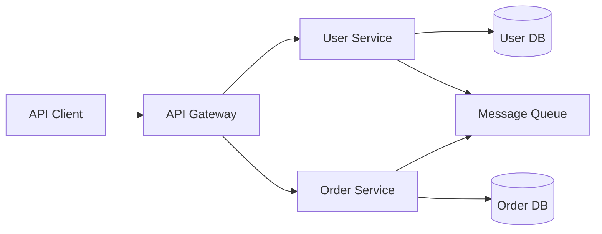

# Getting Started with Spring Boot Microservices

Spring Boot has become the de facto standard for building microservices in the Java ecosystem. In this post, we'll walk through creating a simple yet production-ready microservice.

## Why Spring Boot?

Spring Boot simplifies the development of Spring-based applications by providing:

- **Auto-configuration** that reduces boilerplate
- **Embedded servers** for easy deployment
- **Production-ready features** like health checks and metrics

## Project Setup

Start by generating a new project using [Spring Initializr](https://start.spring.io/):

```java
@SpringBootApplication
public class UserServiceApplication {
    public static void main(String[] args) {
        SpringApplication.run(UserServiceApplication.class, args);
    }
}
```

## Architecture Overview

Here's a high-level view of our microservice architecture:



## Creating a REST Controller

```java
@RestController
@RequestMapping("/api/users")
public class UserController {

    private final UserService userService;

    public UserController(UserService userService) {
        this.userService = userService;
    }

    @GetMapping
    public List<User> getAllUsers() {
        return userService.findAll();
    }

    @PostMapping
    public ResponseEntity<User> createUser(@RequestBody User user) {
        User created = userService.create(user);
        return ResponseEntity.status(HttpStatus.CREATED).body(created);
    }
}
```

## Best Practices

1. **Use DTOs** to decouple your API contract from your domain model
2. **Implement proper error handling** with `@ControllerAdvice`
3. **Write tests** at every level — unit, integration, and contract
4. **Use profiles** for environment-specific configuration

## Conclusion

Spring Boot makes it straightforward to build production-grade microservices. Start small, follow best practices, and iterate as your system grows.
