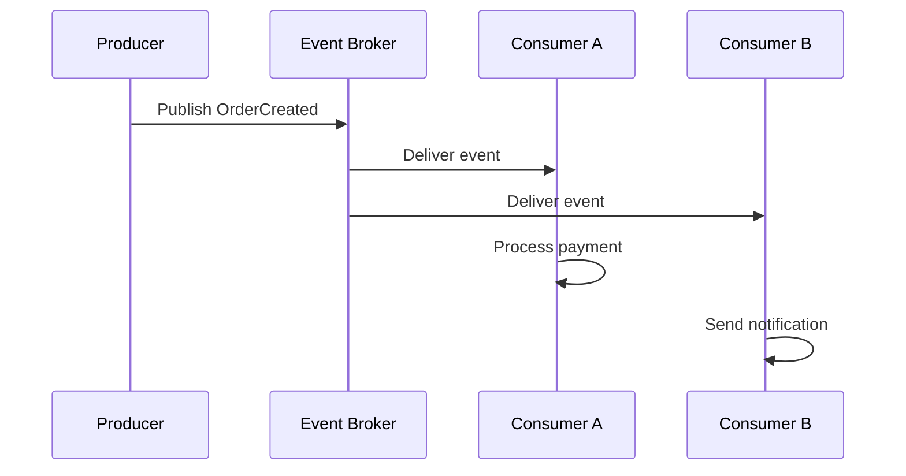

# Understanding Event-Driven Architecture

Event-driven architecture (EDA) is a design pattern that promotes the production, detection, and consumption of events. It's become a cornerstone of modern distributed systems.

## What is an Event?

An event represents a significant change in state. For example:

- A user registered
- An order was placed
- A payment was processed

## Core Components



## Benefits

- **Loose coupling**: Services don't need to know about each other
- **Scalability**: Consumers can be scaled independently
- **Resilience**: If a consumer is down, events are queued
- **Flexibility**: New consumers can be added without modifying producers

## When to Use EDA

Event-driven architecture shines when:

1. You need **asynchronous processing**
2. Multiple services need to **react to the same event**
3. You want to build an **audit trail** of everything that happened
4. You need to decouple services for **independent deployment**

## Implementation with Apache Kafka

```java
@Service
public class OrderEventProducer {

    private final KafkaTemplate<String, OrderEvent> kafkaTemplate;

    public OrderEventProducer(KafkaTemplate<String, OrderEvent> kafkaTemplate) {
        this.kafkaTemplate = kafkaTemplate;
    }

    public void publishOrderCreated(Order order) {
        OrderEvent event = new OrderEvent("ORDER_CREATED", order);
        kafkaTemplate.send("orders", order.getId(), event);
    }
}
```

## Conclusion

Event-driven architecture is a powerful pattern for building scalable, resilient distributed systems. Start with simple pub/sub patterns and evolve as your needs grow.
